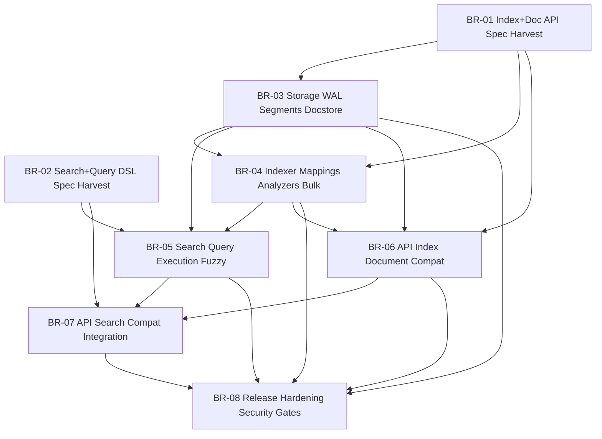

# PLAN - Surch Orchestrated Roadmap

Status: Updated 2026-04-25. Governance refit in progress. Branch-centered execution model adopted. Source branch files live in `plan/01_BRANCH_*.md` onward. Governing spec: `spec/SPEC_EVOL_SURCH_GOVERNANCE_ORCHESTRATION.md`.

## 1) Current State

**Completed governance milestones:**
- `docs(plan): add governance documentation design spec` (`b4a2f7e`)
- `docs(plan): align governance spec with entropic structure` (`eb19d91`)

**Current engineering baseline:**
- Rust workspace scaffold exists: `surch-core`, `surch-api`
- Initial storage, indexer, search, and API skeletons exist
- Governance and execution model were previously underspecified

**Current conductor decision:**
- adopt Entropic-like branch orchestration adapted for Rust
- use `PLAN.md` as conductor index
- use numbered branch files in `plan/` as execution source of truth per branch
- cap parallel execution at 4 subagents
- treat OpenSearch spec harvesting as a first-class prerequisite

## 2) MVP Contract

**In scope:**
- index creation and deletion
- document CRUD and bulk indexing
- mappings and analyzers for MVP field types
- Query DSL core: `match`, `match_phrase`, `multi_match`, `term`, `terms`, `range`, `exists`, `bool`, `prefix`, `wildcard`, `regexp`, `fuzzy`
- search endpoint compatibility
- fuzzy behavior up to edit distance 2
- storage durability sufficient for single-node MVP

**Out of scope for MVP:**
- full analytics and advanced aggregations
- clustering and replication
- snapshots and restore
- plugin system
- production-grade authn/authz beyond foundations

## 3) Operating Model

### Source Of Truth Order
1. Direct user instructions
2. `AGENTS.md`
3. `rules/MASTER.md`
4. `rules/workflow.md`
5. `PLAN.md`
6. `plan/NN_BRANCH_*.md`
7. `spec/*.md`
8. Helper rules such as `rules/testing.md`, `rules/security.md`, `rules/dev-env.md`, `rules/subagents.md`, `rules/superpowers.md`

### Drumbeat
For Surch, drumbeat means continuous forward motion:
- keep conductor continuity until the current governance or implementation slice is complete
- move lot by lot
- surface blockers immediately
- do not stall in abstract analysis once the next concrete step is known

### Parallelism Cap
- maximum 4 active subagents at once
- one subagent owns one branch at a time
- conductor remains sole integrator

## 4) Spec Harvesting Matrix

| Surface | Primary Spec File | Status | Notes |
|---|---|---|---|
| Index + Document APIs | `spec/SPEC_OS_INDEX_AND_DOCUMENT_APIS.md` | confirmed | Confirmed by BR-01, ready for BR-03, BR-04, and BR-06 consumption |
| Search + Query DSL | `spec/SPEC_OS_SEARCH_AND_QUERY_DSL.md` | confirmed | Confirmed by BR-02, ready for BR-05 and BR-07 consumption |
| Security + Testing Baseline | `spec/SPEC_SECURITY_AND_TESTING_BASELINE.md` | drafted | Used as governance input and release gate baseline |
| MatchID Elastic Parity Exit Criteria | `spec/SPEC_MATCHID_ELASTIC_PARITY_EXIT_CRITERIA.md` | drafted | Final acceptance target is Elastic parity in MatchID context, not full MatchID cloning |
| Governance Orchestration | `spec/SPEC_EVOL_SURCH_GOVERNANCE_ORCHESTRATION.md` | active | Governs this repo structure |

Status vocabulary:
- `unread`
- `drafted`
- `confirmed`
- `implemented`
- `verified`

## 5) Branch Catalog

| ID | Branch | Owner | Status | Depends On | File |
|---|---|---|---|---|---|
| BR-01 | `feature/BR-01-spec-harvest-index-doc-api` | #4 APIServer | ready | — | `plan/01_BRANCH_spec-harvest-index-and-document-apis.md` |
| BR-02 | `feature/BR-02-spec-harvest-search-query-dsl` | #3 SearchEngine | ready | — | `plan/02_BRANCH_spec-harvest-search-and-query-dsl.md` |
| BR-03 | `feature/BR-03-storage-wal-segments-docstore` | #1 StorageEngine | active | BR-01 | `plan/03_BRANCH_storage-wal-segments-and-docstore.md` |
| BR-04 | `feature/BR-04-indexer-mappings-analyzers-bulk` | #2 Indexer | active | BR-01, BR-03 | `plan/04_BRANCH_indexer-mappings-analyzers-and-bulk-contract.md` |
| BR-05 | `feature/BR-05-search-query-exec-fuzzy` | #3 SearchEngine | active | BR-02, BR-03, BR-04 | `plan/05_BRANCH_search-query-execution-and-fuzzy.md` |
| BR-06 | `feature/BR-06-api-index-document-compat` | #4 APIServer | plan | BR-01, BR-03, BR-04 | `plan/06_BRANCH_api-index-and-document-compat.md` |
| BR-07 | `feature/BR-07-api-search-compat-integration` | #4 APIServer | plan | BR-02, BR-05, BR-06 | `plan/07_BRANCH_api-search-compat-and-integration.md` |
| BR-08 | `release/v0.1.0-mvp` | Conductor | plan | BR-03, BR-04, BR-05, BR-06, BR-07 | `plan/08_BRANCH_release-hardening-and-security-gates.md` |

## 6) Dependency Graph

## 7) Wave Sequencing

### Wave 0 - Spec Confirmation
- BR-01
- BR-02

Goal:
- lock exact MVP syntax and response shape before implementation branches diverge

### Wave 1 - Core Engine Foundations
- BR-03
- BR-04

Goal:
- durable write path
- mapping and analyzer contract aligned with indexed representation

### Wave 2 - Search And API Vertical Slice
- BR-05
- BR-06

Goal:
- executable search semantics
- index/document API compatibility

### Wave 3 - Integration And Release
- BR-07
- BR-08

Goal:
- search API compatibility
- integration tests
- hardening and release gate

## 8) Branch Execution Rules

- every real implementation branch must have a corresponding `plan/NN_BRANCH_*.md`
- every branch file must define allowed and forbidden paths
- branch files own the detailed lots and validation checklists
- `PLAN.md` tracks dependencies, status, and wave sequencing only
- no branch may silently expand scope beyond its file contract

## 9) Feedback Loop Types

- `blocked`: missing prerequisite or unresolved dependency
- `attention`: risk, ambiguity, or expected drift
- `spec-mismatch`: behavior or syntax differs from harvested spec
- `security-alert`: abuse path, validation gap, or risky dependency
- `clarification`: conductor or user decision required

All active feedback items must be recorded in the branch file before merge.

## 10) Verification Gates

### Required Before Merge
- `cargo fmt --all`
- `cargo clippy --workspace --all-targets --all-features`
- relevant unit tests
- relevant integration tests
- branch checklist complete
- no unresolved blocker in branch file

### Required Before Release
- full workspace tests
- compatibility smoke on documented endpoints
- fuzzy behavior checks
- documented security review against `spec/SPEC_SECURITY_AND_TESTING_BASELINE.md`
- release branch checklist complete

## 11) Security Gate Summary

The MVP release must reject known avoidable gaps in these areas:
- unbounded request body size
- unbounded wildcard or regex execution
- missing validation for core API payloads
- dependency vulnerabilities with no documented mitigation path

Detailed baseline: `spec/SPEC_SECURITY_AND_TESTING_BASELINE.md` and `rules/security.md`.

## 12) Final Exit Criteria

The final project target is not to clone MatchID as a whole application.

The final target is to replace Elasticsearch in the MatchID usage context with Surch, with:
- zero accepted search gap on the agreed corpus
- no performance regression versus Elasticsearch baseline

Reference spec: `spec/SPEC_MATCHID_ELASTIC_PARITY_EXIT_CRITERIA.md`.

## 13) Superpowers Framing

Superpowers skills are allowed only as helpers.

They must not:
- override Surch branch structure
- relocate specs away from `spec/`
- replace branch execution files with their own format
- bypass branch scope boundaries or verification gates

Project-specific framing is defined in `rules/superpowers.md`.

## 14) Next Working Set

Immediate repo goals:
- finalize governance docs
- finalize branch template and subagent prompt
- finalize ruleset
- lock branch files BR-01 through BR-08

After that:
- launch BR-01 and BR-02 first
- then proceed wave by wave
